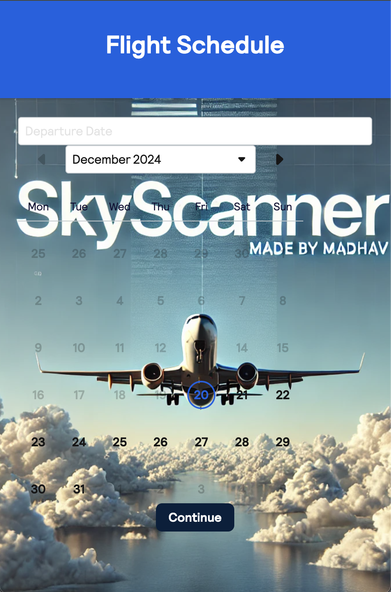

# Basic Backpack React Project

This project was bootstrapped with [Create React App](https://github.com/facebook/create-react-app) and extended with [backpack-react-scripts](https://github.com/Skyscanner/backpack-react-scripts/tree/master/packages/react-scripts).

<details>
  <summary><h2>Steps to Clone and Run the Project Locally</h2></summary>

1. **Clone the Repository:**
   - Open your terminal and clone the repository to your local machine:
     ```bash
     git clone https://github.com/your-repo/basic-backpack-react.git
     ```

2. **Navigate to the Project Folder:**
   - Change to the project directory:
     ```bash
     cd basic-backpack-react
     ```

3. **Install Dependencies:**
   - Install all necessary dependencies listed in the `package.json`:
     ```bash
     npm install
     ```

4. **Run the Application:**
   - Start the app in development mode:
     ```bash
     npm start
     ```
   - Open your browser and go to [http://localhost:3000](http://localhost:3000/) to view the application. The page will automatically reload when you make edits.

5. **Build for Production (Optional):**
   - If you want to create a production build of the app:
     ```bash
     npm run build
     ```
   - This will generate a minified and optimized version of the app in the `build/` folder.

</details>

<details>
  <summary><h2>Key Features & Configuration</h2></summary>

### 1. **React Externals**
   - Exclude React and ReactDOM from the output bundle for improved performance. This is useful when React is already loaded globally on the page.
   - In `package.json`, add:
     ```json
     "backpack-react-scripts": {
       "externals": {
         "react": "React",
         "react-dom": "ReactDOM"
       }
     }
     ```
   - This reduces the bundle size, but ensures React is loaded globally before the app is run.

### 2. **Server-Side Rendering (SSR)**
   - If you need to pre-render your app’s HTML on the server for better performance or SEO:
     1. Create an `ssr.js` file in the root folder:
        ```js
        import App from './App';
        export default { App };
        ```
     2. After building, configure your server to render the app with `ReactDOMServer` (e.g., using Express).

### 3. **CSS Modules**
   - By default, Sass files are treated as CSS Modules. If you want to opt-out globally, add the following:
     ```json
     "backpack-react-scripts": {
       "cssModules": false
     }
     ```
   - If you choose to opt-out, you can still enable CSS Modules per file by naming them `*.module.scss`.

### 4. **Excluding External Dependencies from SSR**
   - Exclude certain modules like `react` or `react-dom` from SSR output for better performance:
     ```json
     "backpack-react-scripts": {
       "ssrExternals": [
         "react",
         "react-dom"
       ]
     }
     ```

### 5. **Custom Babel Configuration**
   - If you need to compile modules containing JSX or non-standard ES features, include them in the `babelIncludePrefixes` array:
     ```json
     "backpack-react-scripts": {
       "babelIncludePrefixes": [
         "my-module-prefix-",
         "some-module"
       ]
     }
     ```

### 6. **Disabling AMD Parsing for Modules**
   - If you encounter issues with AMD module support, disable it for specific dependencies:
     ```json
     "backpack-react-scripts": {
       "amdExcludes": [
         "globalize"
       ]
     }
     ```

### 7. **Cross-Origin Loading of Dynamic Chunks**
   - Configure cross-origin loading of dynamic chunks:
     ```json
     "backpack-react-scripts": {
       "crossOriginLoading": "anonymous"
     }
     ```

</details>

## Demo



## Author : MADHAV

Feel free to reach out for questions or contributions!
Happy Coding ! 🚀
